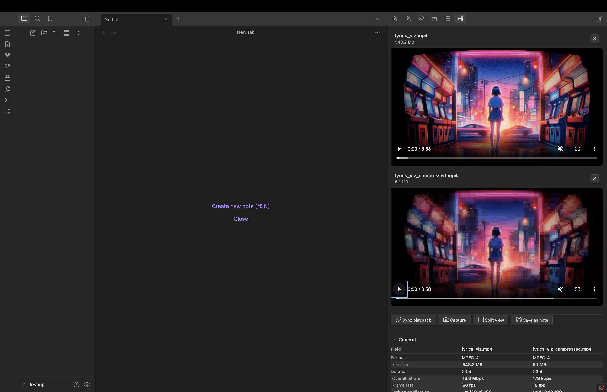
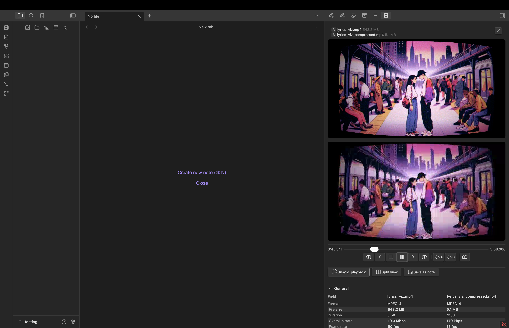
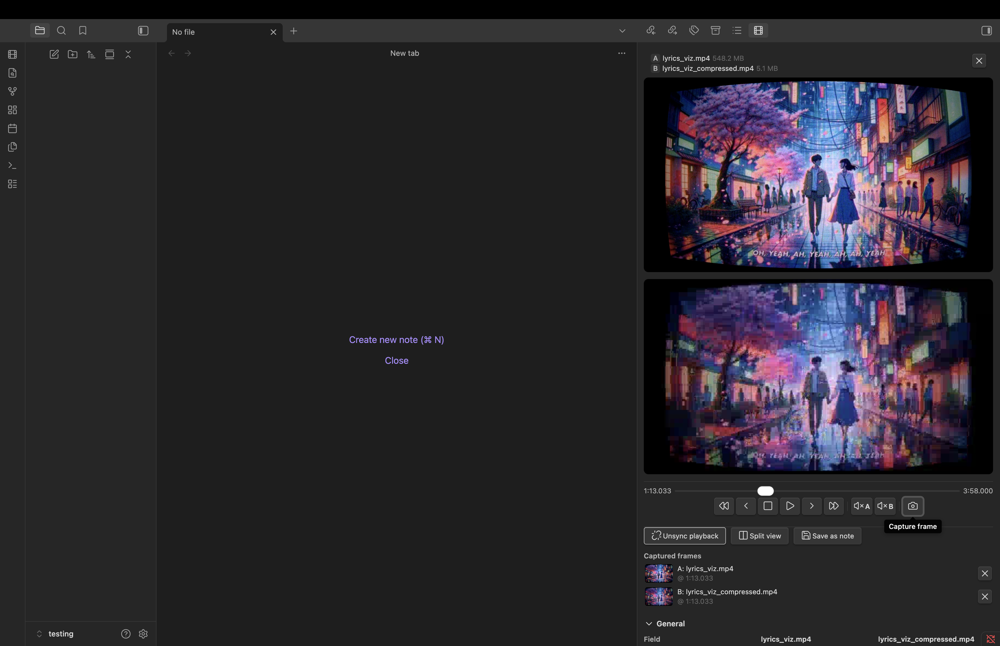
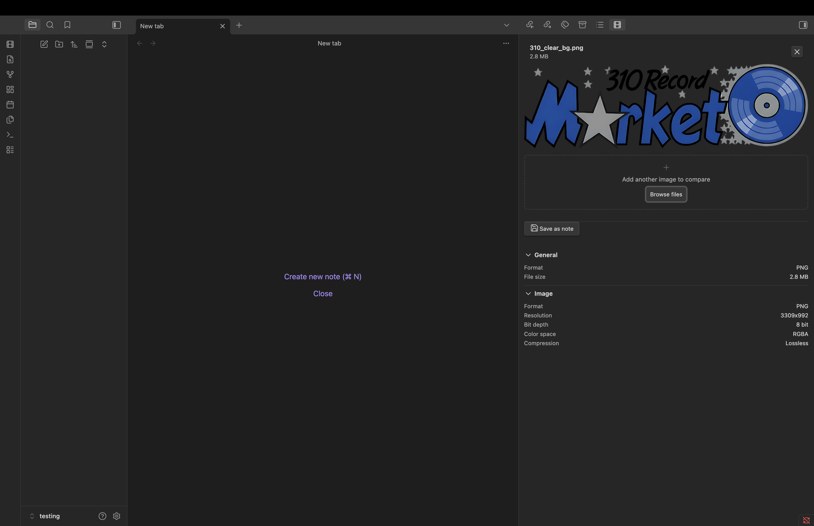
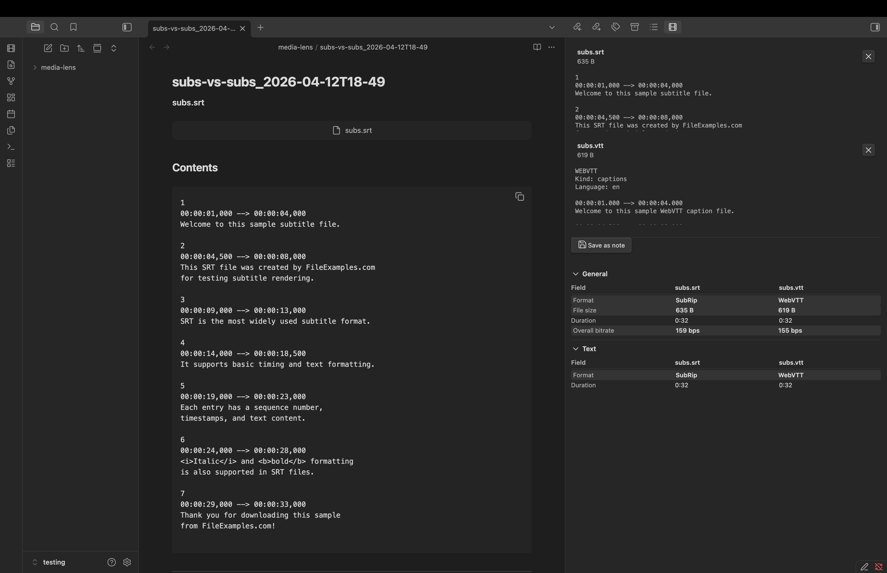

# Media Lens

View detailed metadata for your media files without leaving Obsidian. Add images, videos, audio files, or subtitle files into the sidebar panel to instantly see format details, codec information, resolution, bitrate, duration, and more.

Compare two files side by side to analyze differences, perfect for reviewing exports, checking transcodes, or auditing deliverables.

## Features

### Inspect any media file
Drop a file into the sidebar or browse from your file system. Media Lens parses the file locally and displays organized metadata in collapsible sections (General, Video, Audio, Text, Image).


**Supported formats:** MP4, MOV, MKV, AVI, WebM, JPEG, PNG, GIF, WebP, TIFF, BMP, SVG, MP3, FLAC, WAV, AAC, OGG, SRT, VTT, ASS, and many more.

---

### Compare two files
Load a second file of the same type to see a side-by-side metadata comparison with differences highlighted. Useful for comparing original vs compressed, different export settings, or before/after edits.



---

### Synced video playback
Compare two video encodes with synchronized playback. A unified transport bar controls both videos — scrub, play/pause, step frame-by-frame, skip forward/back, and mute each player independently.



---

### Split view
Open a modal that overlays both videos with a draggable vertical divider. Drag the divider to reveal more of either source for additional visual quality comparison.


---

### Frame capture
Grab screenshots from video players at any point. In synced mode, both players are aligned to the same frame before capturing. Split view captures a composite showing both sources split at the divider (labeled A|B).



---

### Save as note
Persist any inspection or comparison as a markdown note in your vault. Notes include embedded media, captured frame screenshots, and metadata tables organized by section. Auto-named with timestamps and auto-incremented to avoid overwrites.


---

### Media previews
Images render inline. Videos and audio files get playback controls. Subtitles show a text preview.





---

### Privacy
All processing happens locally. No data is sent to any server.

## Use Cases

- **Video QC** — compare encodes, verify codec settings, check bitrate, resolution, and HDR metadata
- **Photography** — view EXIF data, camera settings, GPS coordinates
- **Audio** — inspect ID3 tags, check sample rate, bitrate, and channel layout
- **Subtitles** — verify format, cue count, and duration
- **Archival** — catalog and document media file properties

## Installation

### Community Plugins

Pending.

### Manual

1. Download `main.js`, `styles.css`, `manifest.json`, and `MediaInfoModule.wasm` from the [latest release](https://github.com/StephQuery/obsidian-media-lens/releases)
2. Create a folder: `your-vault/.obsidian/plugins/media-lens/`
3. Copy the downloaded files into that folder
4. Enable the plugin in **Settings → Community Plugins**

## Usage

1. Click the film strip icon in the left ribbon, or run the **Show panel** command
2. Drag a media file into the drop zone, or click **Browse files**
3. Metadata appears in collapsible sections below the preview
4. Load a second file of the same type to compare
5. Click **Sync playback** to link both video players
6. Click **Split view** to open the full-screen visual comparison
7. Click the camera icon to capture frames
8. Click **Save as note** to persist everything as a markdown note

## Compatibility

- **Desktop:** Supported
- **Mobile:** Not recommended — WASM loading and video playback may have limited support on mobile devices
- **Minimum Obsidian version:** 0.15.0

## Support

Found a bug or have a feature request? [Open an issue on GitHub](https://github.com/StephQuery/obsidian-media-lens/issues).

## Development

```bash
npm install
npm run dev        # watch mode
npm run build      # production build
npm run lint       # eslint
npm test           # vitest
npm run test:watch # vitest watch mode
```

## License

[MIT](LICENSE)

---

Uses [mediainfo.js](https://github.com/buzz/mediainfo.js) for media file parsing.
